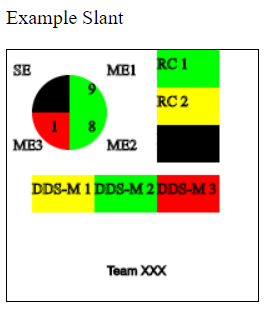

# slantDisplayUtility

This utility willl create a display to show a slant status. It includes example data and can be updated to show a stoplight chart.

Copy the code and create a local file "index.html", open a web browser and open the file. The slant will display. Update the numbers to show the appropriate slant.

## Example Slant Graphic

