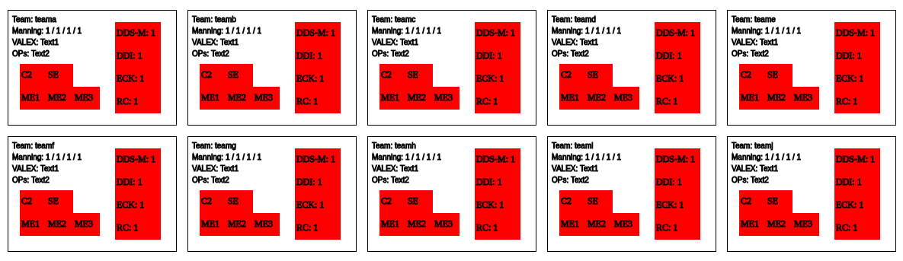

# slantDisplayUtility

This utility willl create a display to show a slant status. It includes example data and can be updated to show a stoplight chart.

## Usage

Copy the code and create a local file "index.html", open a web browser and open the index.html file. Copy the csv template file, load the template into the local index.html. The slant will display. Update the numbers to change the display of the slant.

## Example Slant Graphic

## Motivation

The slant display utility provides structure for reporting. Often, the structure for reporting is conveyed by a written standard and reports do not always follow the specified standard. The slant display utility captures report structure in the code to display a standardized report by taking a simple csv file as input. The report generation can be changed and redistributed as requirements change. This is meant to minimize time spent updating a chart and provide greater situational understanding.

